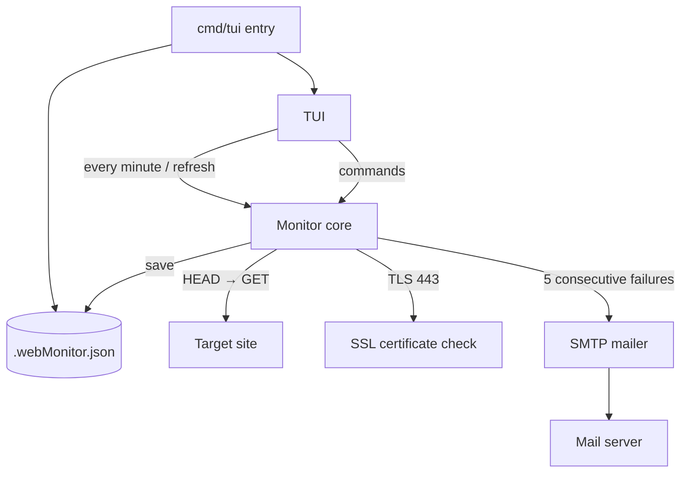

> [!NOTE]
> This README was generated by [SKILL](https://github.com/agenvoy/skill-readme-generate), get the ZH version from [here](./doc/README.zh.md).

***

<strong>KEEP EVERY SITE IN SIGHT, RIGHT FROM YOUR TERMINAL!</strong>

***

> A Go terminal uptime monitor CLI with HEAD-first website checks, SSL certificate expiry countdown, and consecutive-failure email alerts

## Table of Contents

- [Features](#features)
- [Architecture](#architecture)
- [License](#license)
- [Author](#author)

## Features

> `git clone https://github.com/pardnchiu/go-web-monitor && cd go-web-monitor && go run ./cmd/tui` · [Documentation](./doc/doc.md)

- **Live Terminal Dashboard** — A TUI table shows each site's status, response time, status code, and overall uptime, refreshed concurrently every minute with no backend service to deploy.
- **HEAD First, GET Fallback** — Probes start with a lightweight HEAD request and switch to GET only on failure or 404, saving bandwidth while still handling servers that reject HEAD.
- **SSL Expiry Countdown** — Reads the certificate on port 443 to compute the days remaining and colors it green, yellow, or red at the 30- and 7-day thresholds.
- **Alert Only on Sustained Failure** — Sends an email only after 5 consecutive offline checks, filtering out false alarms from transient blips.
- **SMTP Configured by Command** — Set the host, credentials, and recipients inside the TUI; the client picks implicit TLS on 465 or STARTTLS on 587 and writes every change back to local JSON.

## Architecture

> [Full Architecture](./doc/architecture.md)

## License

This project is licensed under the [MIT LICENSE](LICENSE).

## Author

Just [open an issue](https://github.com/pardnchiu/go-web-monitor/issues/new) to share an idea.

***

©️ 2025 [邱敬幃 Pardn Chiu](https://www.linkedin.com/in/pardnchiu)
