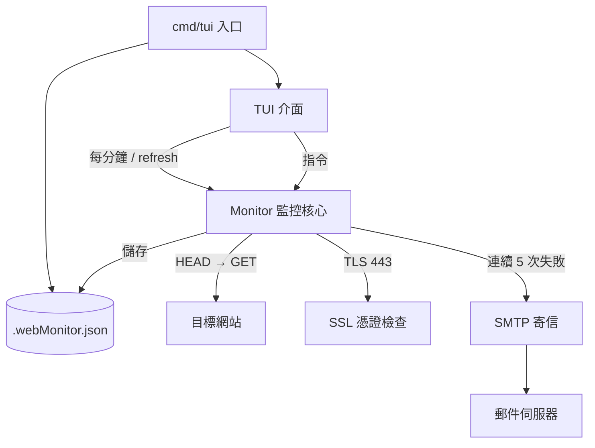

> [!NOTE]
> 此 README 由 [SKILL](https://github.com/agenvoy/skill-readme-generate) 生成，英文版請參閱 [這裡](../README.md)。

***

<strong>KEEP EVERY SITE IN SIGHT, RIGHT FROM YOUR TERMINAL!</strong>

***

> Go 終端機網站監控工具，具備 SSL 憑證到期追蹤、連續失敗 Email 告警與 HEAD 優先探測

## 目錄

- [功能特點](#功能特點)
- [架構](#架構)
- [授權](#授權)
- [Author](#author)

## 功能特點

> `git clone https://github.com/pardnchiu/go-web-monitor && cd go-web-monitor && go run ./cmd/tui` · [完整文件](./doc.zh.md)

- **終端機即時監控面板** — 以 TUI 表格呈現每個網站的狀態、回應時間、狀態碼與可用率，每分鐘自動並行刷新，不需架設任何後台服務。
- **HEAD 優先、GET 回退** — 先以輕量 HEAD 請求探測，失敗或回 404 才改送 GET，兼顧頻寬與不支援 HEAD 的伺服器。
- **SSL 憑證到期倒數** — 直接讀取 443 埠憑證計算剩餘天數，並以 30 天與 7 天為門檻標示綠、黃、紅。
- **連續失敗才告警** — 同一網站連續 5 次離線才寄出 Email，過濾瞬斷造成的誤報。
- **SMTP 全程指令設定** — 在 TUI 內即可設定主機、帳號與收件人，自動依 465 隱式 TLS 或 587 STARTTLS 建立連線，設定即時寫回本地 JSON。

## 架構

> [完整架構](./architecture.zh.md)

## 授權

本專案採用 [MIT LICENSE](../LICENSE)。

## Author

Just [open an issue](https://github.com/pardnchiu/go-web-monitor/issues/new) to share an idea.

***

©️ 2025 [邱敬幃 Pardn Chiu](https://www.linkedin.com/in/pardnchiu)
