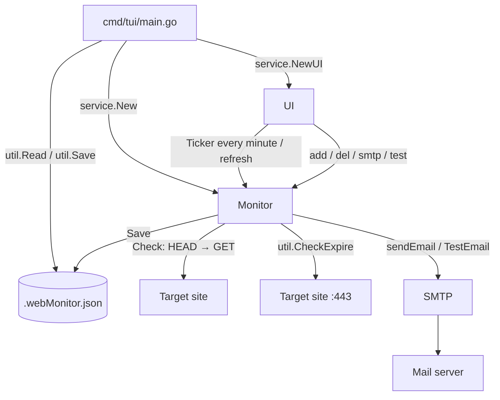
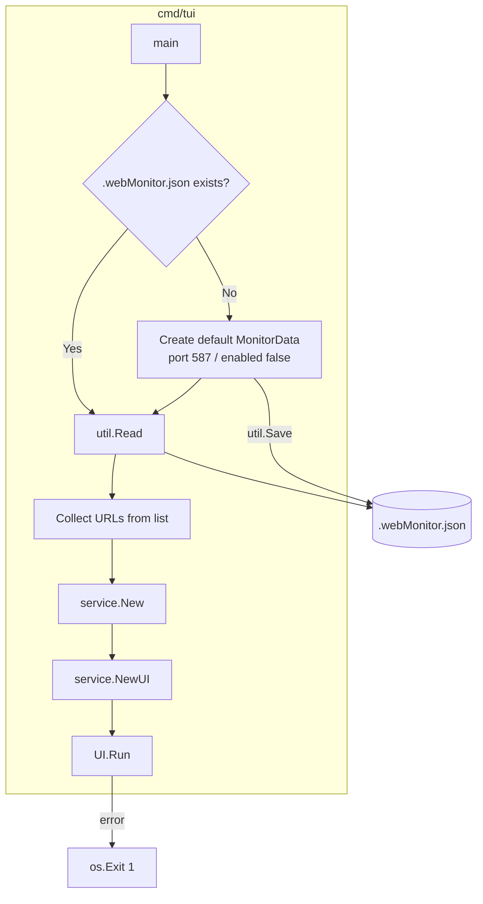
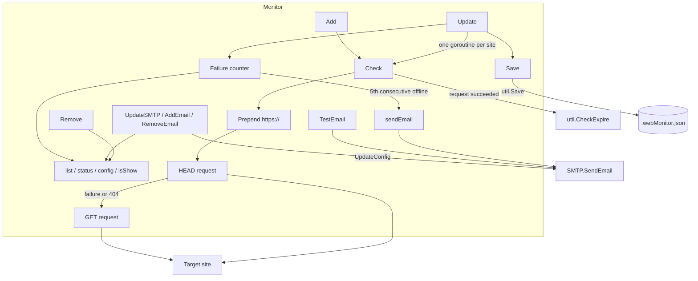
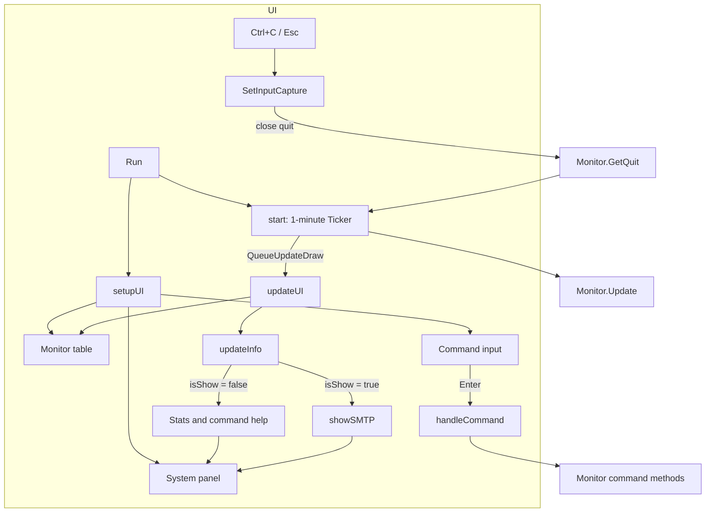
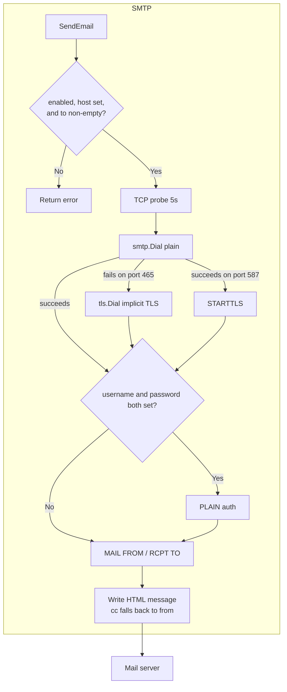
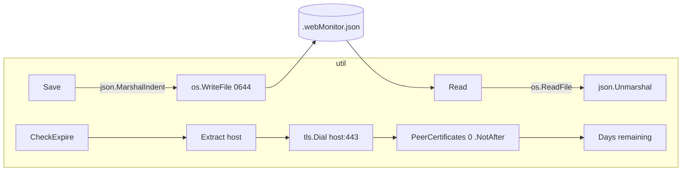
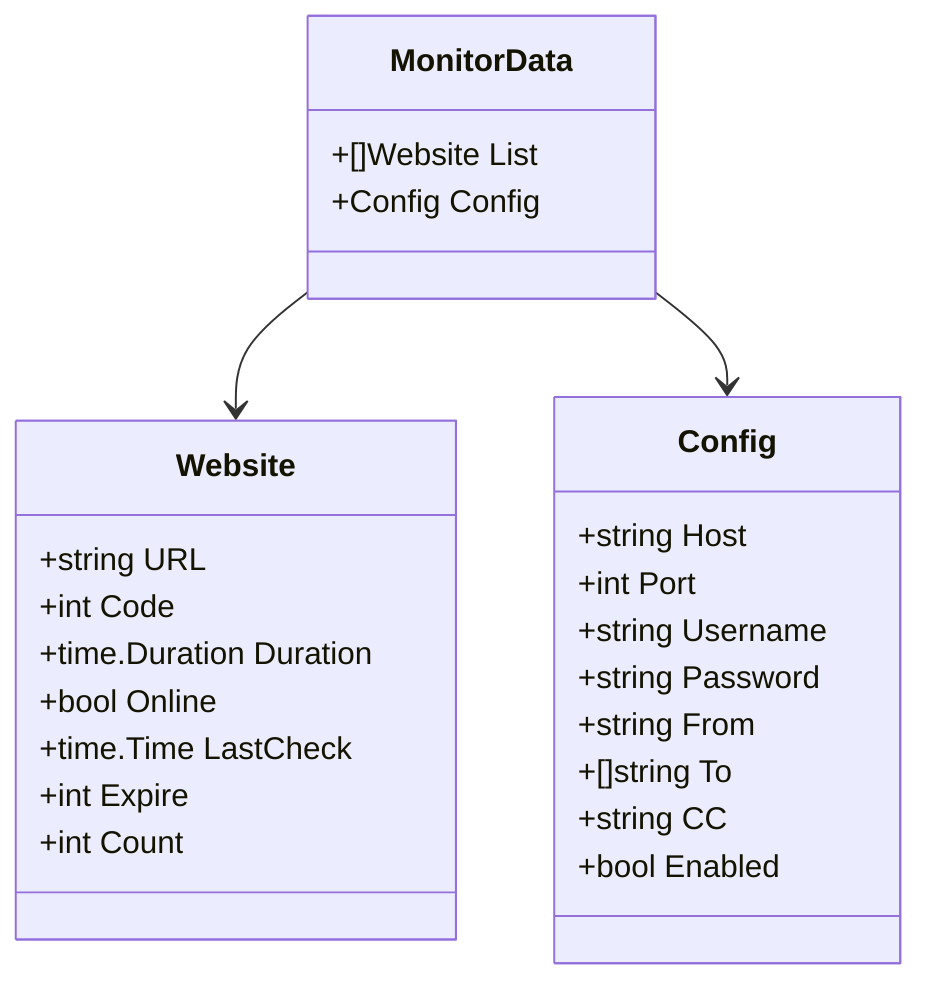
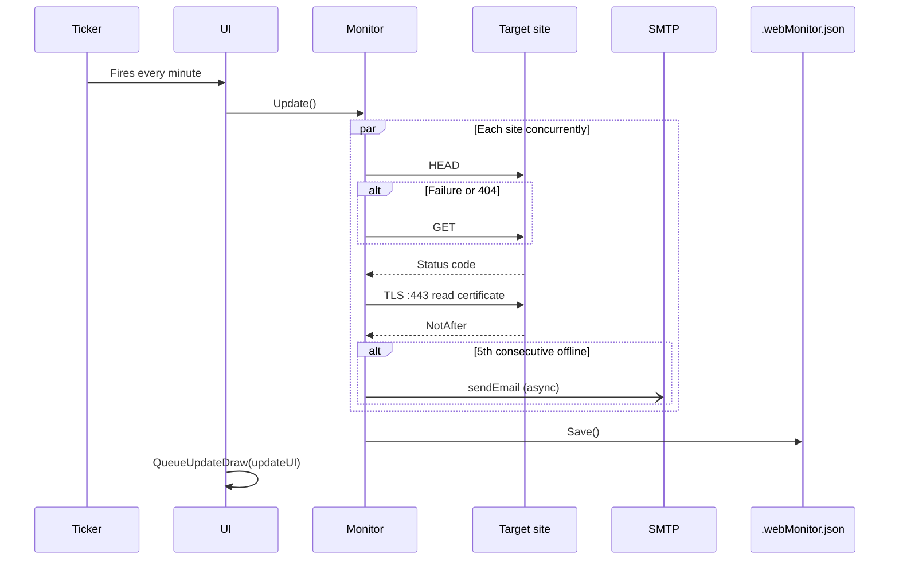
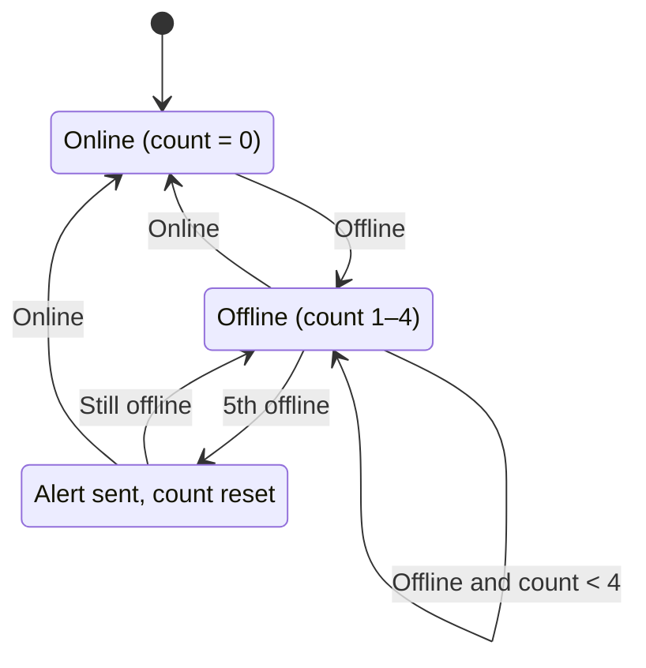
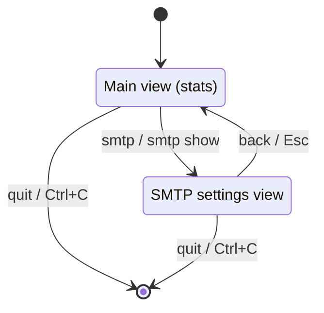

# go-web-monitor - Architecture

> Back to [README](../README.md)

## Overview

## Module: cmd/tui

The entry point initializes the config file and wires Monitor to UI.

## Module: service/Monitor

The monitoring core holds the watch list, status table, and SMTP config, guarding shared state with `sync.RWMutex`.

## Module: service/UI

The tview-based terminal interface schedules checks, renders the table, and parses commands.

## Module: service/SMTP

Picks the connection mode by port and sends HTML email.

## Module: internal/util

Stateless helpers for config file IO and SSL expiry calculation.

## Module: internal/model

## Data Flow

## State Machine

### Site Failure Counter

### UI Views

***

©️ 2025 [邱敬幃 Pardn Chiu](https://www.linkedin.com/in/pardnchiu)
