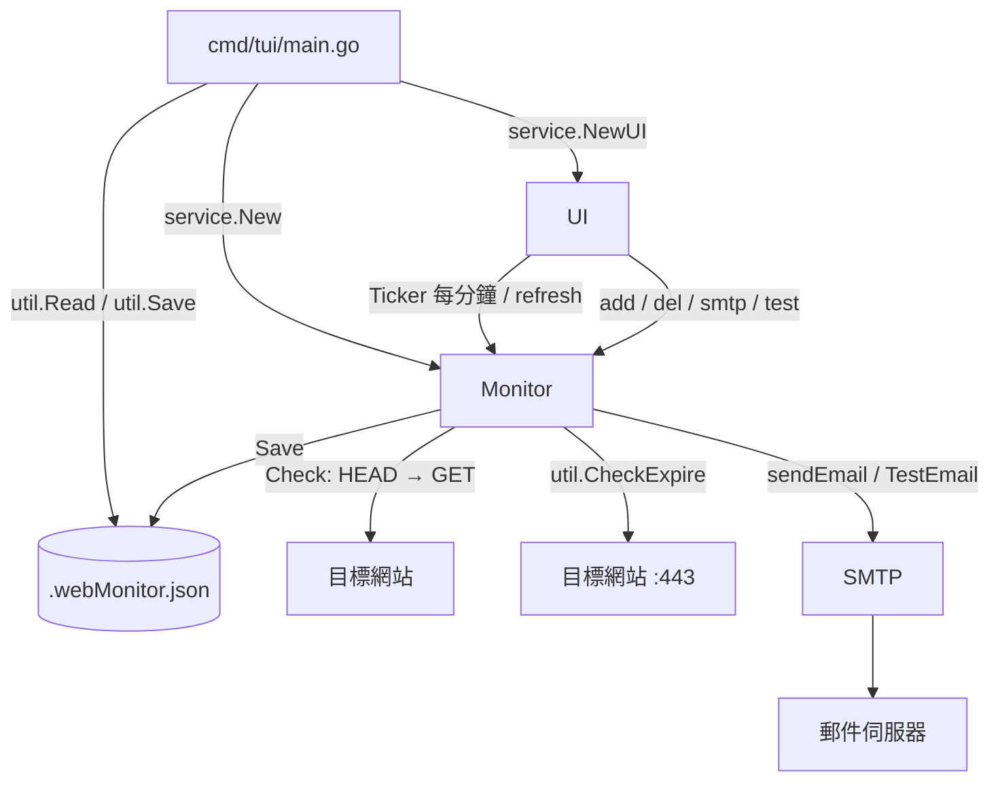
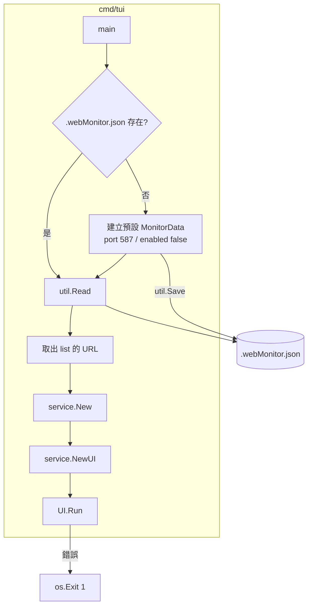
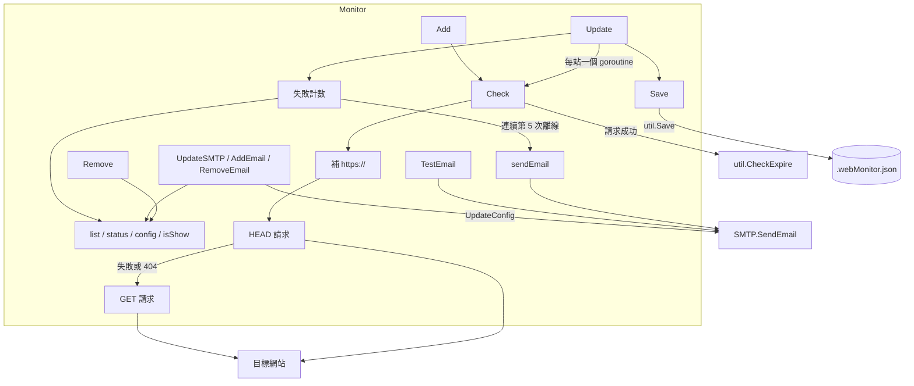
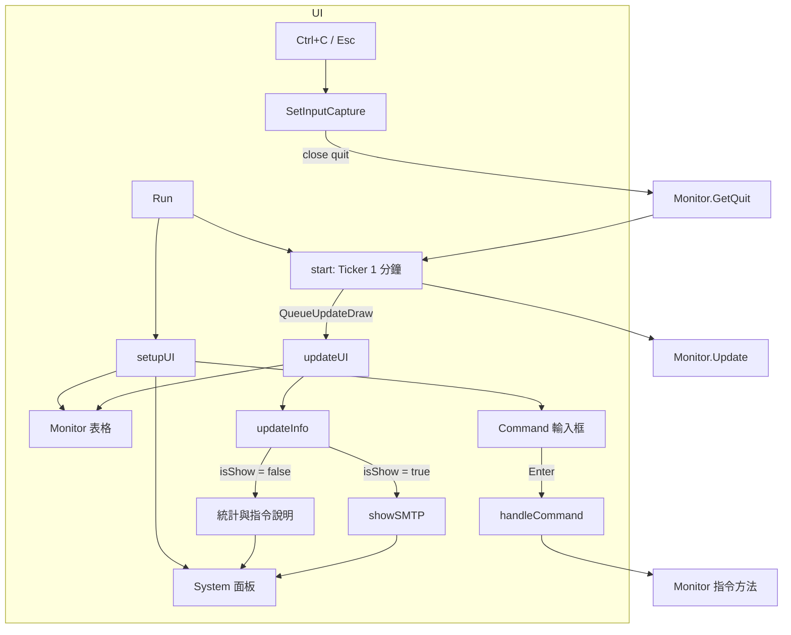
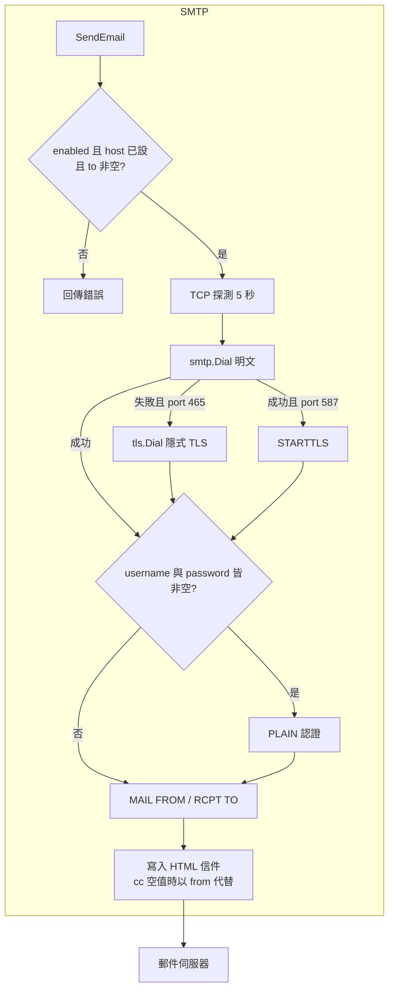
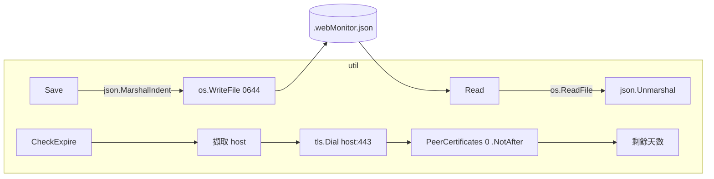
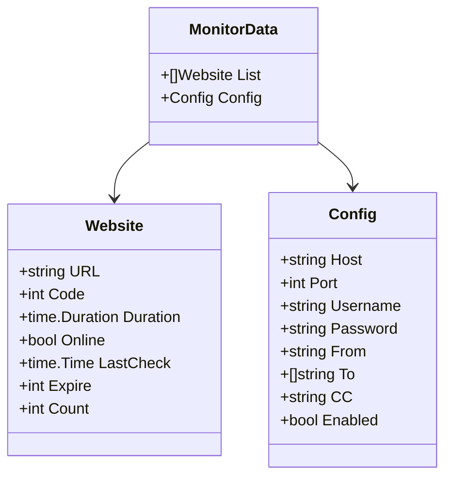
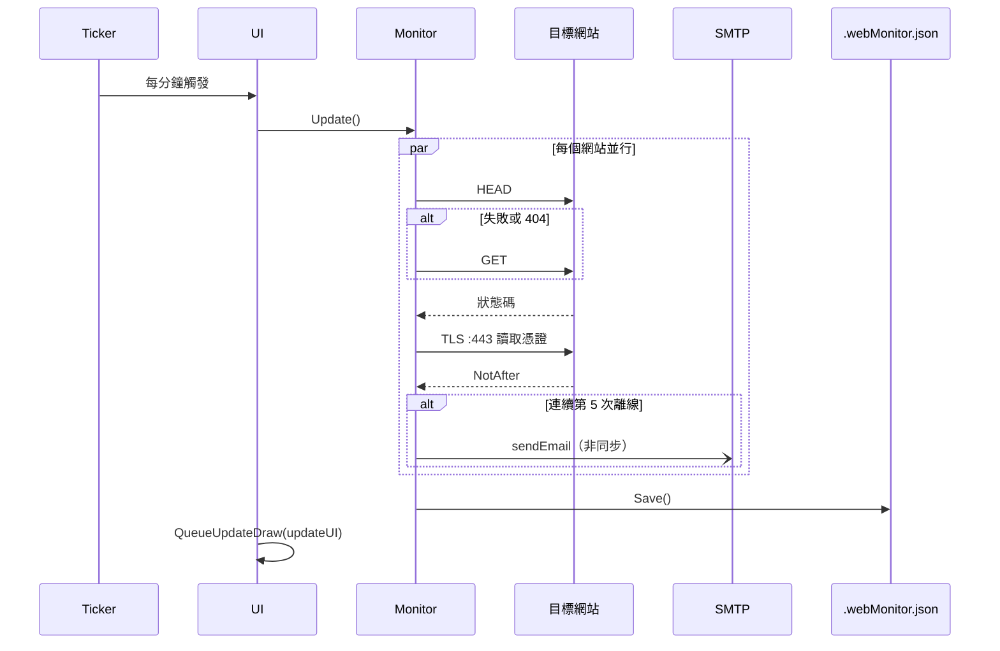
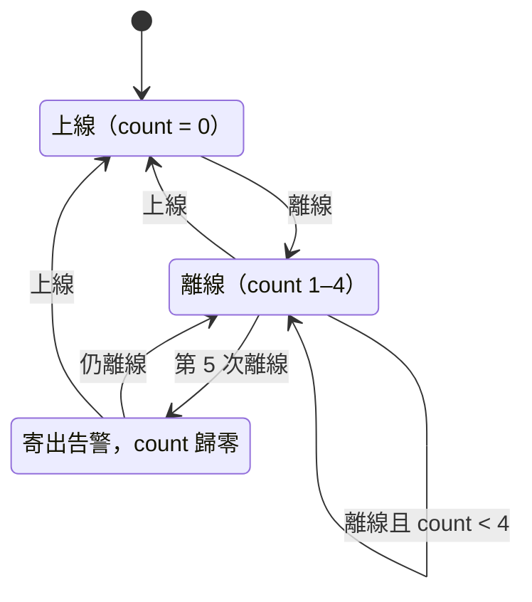
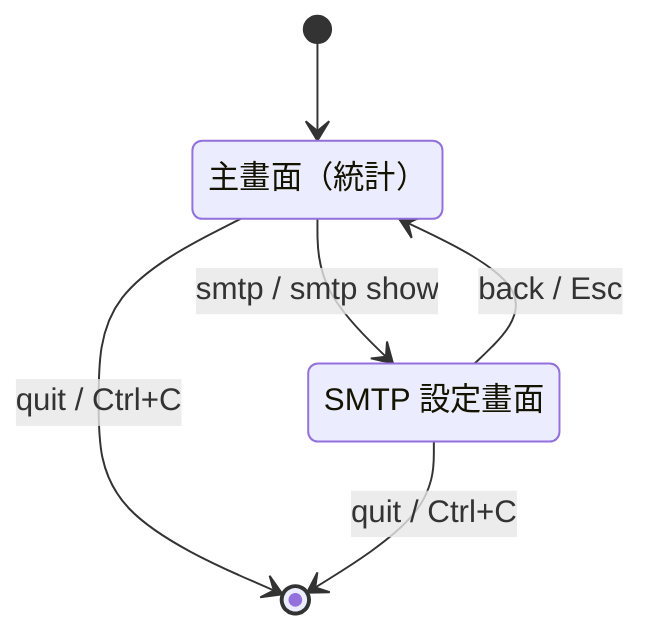

# go-web-monitor - 架構

> 返回 [README](./README.zh.md)

## 概覽

## Module: cmd/tui

程式入口，負責初始化設定檔並組裝 Monitor 與 UI。

## Module: service/Monitor

監控核心，持有監控清單、狀態表與 SMTP 設定，以 `sync.RWMutex` 保護共享狀態。

## Module: service/UI

基於 tview 的終端介面，負責排程檢查、渲染表格與解析指令。

## Module: service/SMTP

依 port 選擇連線方式並以 HTML 格式寄信。

## Module: internal/util

無狀態工具：設定檔讀寫與 SSL 憑證到期天數計算。

## Module: internal/model

## 資料流

## 狀態機

### 網站失敗計數

### 介面畫面

***

©️ 2025 [邱敬幃 Pardn Chiu](https://www.linkedin.com/in/pardnchiu)
